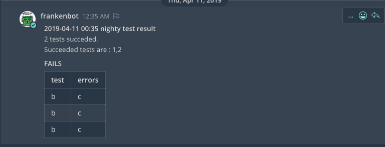

# matterbot_ws
Webservice used to call mattermost api by other programs.

# How to use it

For the moment, there is only one webservice, that should push tests results to mattermost by this way
    

You have to specify a channel name, a team name and you message.
The message should contain two keys: success and errors.

# TODO

Push general message

